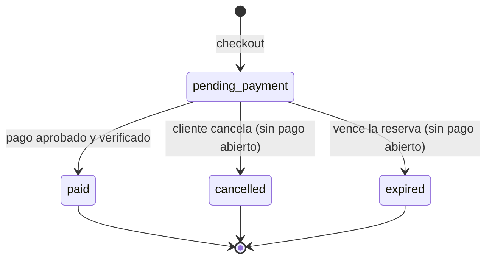

# Diseño de pagos online (Fase 3)

Estado: **propuesta para revisión, sin código escrito**. Cierra la Fase 3 sobre el carrito, el checkout con retiro en el local y la reserva de stock que ya existen. Las decisiones que dependen del negocio están en [Decisiones abiertas](#decisiones-abiertas).

## Objetivo y alcance

Un cliente con un pedido `pending_payment` puede pagarlo online con **Bancard o Pagopar**, y el sistema pasa el pedido a `paid` solo cuando la pasarela lo confirma de forma verificable.

Dentro del alcance: iniciar el pago, recibir y verificar la confirmación, conciliar pagos que no llegaron, convivir con la expiración de reservas, mostrar el estado, mandar el recibo por email.

Fuera del alcance (Fase 4): panel de gestión de pedidos, reembolsos desde el admin, reportes. Aquí solo se deja el modelo preparado.

## Qué ya existe y condiciona el diseño

| Pieza | Condición para pagos |
| --- | --- |
| `Orders.status` = `pending_payment`, `cancelled`, `expired` | Falta `paid`. `orderStatusLabel` es un `Record` exhaustivo: TypeScript obliga a etiquetar el estado nuevo. |
| `expirePendingOrders` libera stock con `FOR UPDATE SKIP LOCKED` | Puede vencer un pedido **mientras el cliente está pagando**. Necesita una guarda. |
| `withTransaction` + bloqueo de fila del pedido | Toda transición de estado se hace dentro de esta transacción. |
| `Orders` no admite create/update/delete por REST ni admin | Se mantiene. `paid` solo lo escribe el servicio de pagos. |
| `refreshOrderCache(orderId)` | Se llama después de confirmar un pago. |
| El precio y stock se congelan en el pedido | El monto a cobrar sale siempre de `order.total` en la base, nunca del cliente. |
| Cron diario en Vercel (plan gratuito) | La conciliación no puede depender de un cron frecuente. El webhook es el camino principal. |

## Lo que dicen las pasarelas

Verificado contra la documentación oficial en la fecha de este documento. Ver [Fuentes](#fuentes) y la advertencia sobre versiones.

| | Bancard (vPOS) | Pagopar |
| --- | --- | --- |
| Inicio | `POST /vpos/api/0.3/single_buy` con `shop_process_id` (entero único), `amount` (`"130.00"`), `currency` `PYG`, `return_url`, `cancel_url` | `POST /api/comercios/2.0/iniciar-transaccion` con `id_pedido_comercio` (único), `monto_total` entero, `comprador.email` obligatorio, `fecha_maxima_pago` |
| Resultado del inicio | `process_id`, con el que se abre la página de pago de Bancard | `data` = hash del pedido, con el que se redirige al checkout de Pagopar |
| Token de autenticación | `md5(private_key + shop_process_id + amount + currency)` | `sha1(private_key + id_pedido + monto_total)` |
| Confirmación | Bancard hace `POST` a una URL **fija registrada en su portal** (no por pedido). Debe responderse HTTP 200 en **60 s**. Token: `md5(private_key + shop_process_id + "confirm" + amount + currency)` | `POST` a la URL configurada en el panel. Token: `sha1(private_key + hash_pedido)`. Reintenta **cada 10 minutos** hasta recibir la respuesta correcta |
| Qué cubre el token de la confirmación | Monto y moneda, **pero no `response_code`** | Solo el `hash_pedido`: **no cubre `pagado` ni `monto`** |
| Verificación servidor a servidor | `get_single_buy_confirmation`: `md5(private_key + shop_process_id + "get_confirmation")` | `POST /api/pedidos/1.1/traer`: `sha1(private_key + "CONSULTA")`. Devuelve `pagado`, `cancelado`, `monto` |
| Cancelación | `single_buy/rollback`. Sirve **mientras la transacción no esté cuponada**; después es un trámite manual con Bancard | No documentada en la API de pedidos. El pedido vence con `fecha_maxima_pago` |
| Pagos sin resultado | Si en **10 minutos** no llega la confirmación, consultar `get_confirmation` y, si no está pagado, hacer `rollback` | La fecha máxima cierra el pedido |
| Ambientes | Staging `https://vpos.infonet.com.py:8888`, producción `https://vpos.infonet.com.py`. Para habilitar producción hay una lista de pruebas (single buy, confirm, rollback manual) | La documentación no especifica un ambiente de pruebas separado; hay una guía de paso a producción |

### Consecuencias de diseño

1. **La confirmación es solo un aviso, no la verdad.** Ningún token cubre por completo el estado de pago (el de Pagopar no cubre `pagado` ni `monto`; el de Bancard no cubre `response_code`). Por eso, ante cada aviso el servidor **consulta a la pasarela** (`fetchStatus`) y decide con esa respuesta y con el monto de la base.
2. **Cada intento de pago tiene su propio identificador**, distinto del pedido. Ambas pasarelas exigen un id único por operación y un pedido puede reintentarse tras un rechazo. Ese id es el `id` de la tabla `Payments` (entero, sirve para Bancard y para Pagopar).
3. **La URL de retorno no prueba nada.** Bancard redirige a `return_url` incluso con tarjeta rechazada. La pantalla de retorno solo lee el estado desde la base.
4. **Las llamadas a la pasarela no se hacen con un bloqueo abierto.** Se guarda el intento, se confirma la transacción, se llama a la pasarela y se guarda el resultado en otra transacción.
5. **El monto de la pasarela y el de la base deben coincidir exactamente**, en guaraníes enteros. Cada adaptador se ocupa de su formato (`"130.00"` en Bancard, entero en Pagopar); el dominio nunca maneja decimales.

## Arquitectura

```
src/lib/payments/
  provider.ts        interfaz PaymentProvider y tipos comunes
  bancard.ts         adaptador Bancard
  pagopar.ts         adaptador Pagopar
  fake.ts            adaptador de prueba (desarrollo y tests, nunca en producción)
  registry.ts        elige el adaptador con PAYMENT_PROVIDER
  service.ts         startPayment, applyPaymentResult, reconcilePayment
  model.ts           estados, transiciones y validaciones puras
src/app/api/pagos/[provider]/notificacion/route.ts   webhook público
src/app/api/cron/reconcile-payments/route.ts         conciliación (Bearer CRON_SECRET)
src/collections/Payments.ts, PaymentEvents.ts
```

### Interfaz de proveedor

```ts
interface PaymentProvider {
  id: 'bancard' | 'pagopar' | 'fake'
  createCheckout(input: {
    paymentId: number          // id del intento; sale de la tabla Payments
    amountGs: number           // entero, tomado de order.total
    description: string
    buyer: { name: string; email: string; phone: string }
    returnUrl: string
    cancelUrl: string
    expiresAt: Date            // fin de la ventana del intento
  }): Promise<{ providerReference: string; redirectUrl: string }>

  // Verifica la firma y extrae la referencia. Lanza si es inválida. No decide si el pago es válido.
  parseNotification(request: Request): Promise<{ lookup: PaymentLookup }>

  // Consulta servidor a servidor. Es la fuente de verdad para aprobar un pago.
  fetchStatus(ref: PaymentLookup): Promise<{
    status: 'approved' | 'rejected' | 'pending' | 'cancelled'
    amountGs: number
    method?: string
    paidAt?: Date
  }>

  cancel?(ref: PaymentLookup): Promise<'cancelled' | 'already_paid' | 'unsupported'>
  acknowledge(): Response      // cuerpo de la respuesta 200 que espera cada pasarela
}
```

`PaymentLookup` es `{ paymentId }` para Bancard (`shop_process_id`) o `{ providerReference }` para Pagopar (`hash_pedido`); el servicio busca el intento con lo que provea cada adaptador.

### Modelo de datos

**`Payments`** (un intento de pago; solo lo escribe el servicio, sin acceso público):

| Campo | Nota |
| --- | --- |
| `order` (id numérico), `customerId` | El dueño se copia del pedido |
| `provider`, `providerReference` | Único por proveedor cuando existe |
| `status` | `created`, `approved`, `rejected`, `cancelled`, `expired`, `error` |
| `amount` (Gs., entero) | Copia de `order.total` al crear el intento |
| `method`, `paidAt`, `verifiedAt` | Se completan al aprobar |
| `expiresAt` | Fin de la ventana del intento (30 min sugeridos) |
| `attempt` | Número de intento del pedido |

Restricción de base: **un solo intento `created` por pedido** (índice único parcial). Evita dos cobros en paralelo. Payload no puede expresar un índice parcial en la colección: se crea en la migración SQL, y en desarrollo con un paso equivalente en el script de preparación de la base.

**`PaymentEvents`**: registro de solo agregado de cada aviso recibido, con proveedor, referencia, hash del cuerpo, resultado del procesamiento y fecha. Sirve para auditoría y para reconstruir incidentes. Nunca guarda tokens ni claves.

**`Orders`**: se agrega el estado `paid` y los campos `paidAt` y `paidAmount`. Sigue sin admitir cambios manuales.

**Migración de producción** (se genera con `npm run db:migrate:create -- payments` después de editar las colecciones y se revisa a mano, como la migración inicial en `migrations/`): `ALTER TYPE enum_orders_status ADD VALUE IF NOT EXISTS 'paid'`, columnas nuevas y las tablas de pagos. `ADD VALUE` no puede usarse en la misma transacción en la que se agrega.

## Flujos

### A. Iniciar el pago

`startPayment(orderId)` es una Server Action (sesión de Better Auth obligatoria).

1. **Transacción 1.** Buscar el pedido por `id` **y** `customerId` de la sesión. Exigir `pending_payment` y `expires_at` en el futuro según el reloj de la base. Bloquear el pedido `FOR UPDATE`. Si hay un intento `created` vigente, devolver su `redirectUrl`; si venció, marcarlo `expired` y pedir su cancelación a la pasarela. Insertar el intento con `amount = order.total`.
2. **Llamada a la pasarela** fuera de toda transacción: `createCheckout`.
3. **Transacción 2.** Guardar `providerReference` y `redirectUrl`. Si la llamada falló, marcar el intento `error`; el pedido sigue `pending_payment` y el cliente puede reintentar.
4. Devolver la URL y redirigir al cliente.

### B. Confirmación (webhook)

`POST /api/pagos/[provider]/notificacion`, público, sin sesión.

1. `parseNotification`: valida firma en tiempo constante. Firma inválida → 400 con cuerpo genérico y evento registrado. Método distinto de `POST` → 405.
2. Buscar el intento. Si no existe, registrar y responder con el acuse (no ayuda a enumerar referencias).
3. `fetchStatus` a la pasarela. Comparar **monto y moneda** con `Payments.amount` y `order.total`.
4. `applyPaymentResult` en una transacción, con bloqueo `FOR UPDATE` del pedido y del intento (siempre en ese orden):
   - Intento ya `approved` → no hace nada y confirma. Reintentos y avisos duplicados son inofensivos.
   - Aprobado y monto correcto, pedido `pending_payment` → pedido `paid`, intento `approved`. El stock ya está reservado, así que no se toca.
   - Rechazado → intento `rejected`; el pedido sigue `pending_payment` y admite otro intento hasta que venza.
   - Aprobado pero pedido `cancelled` o `expired` (**pago tardío**) → no se cambia el pedido. Ver [Decisión 3](#decisiones-abiertas).
   - Monto distinto → intento `error`, alerta en el log, sin cambiar el pedido.
5. Después del commit: `refreshOrderCache(orderId)` y envío del recibo.
6. Responder con el acuse de la pasarela **solo después de que el commit sea durable**. Ante un error interno, responder 5xx para que Pagopar reintente (cada 10 minutos). Como el documento de Bancard revisado no describe reintentos, la conciliación (flujo D) es la red de seguridad.

### C. Retorno del cliente

`/cuenta/pedidos/[id]` lee el estado desde la base. Con un intento abierto y el pedido aún pendiente muestra "Confirmando tu pago…", vuelve a consultar cada pocos segundos y, pasado un tiempo, dispara una conciliación puntual (`reconcilePayment`) de ese intento. Los parámetros de la URL solo eligen qué mensaje mostrar mientras tanto; nunca cambian el estado.

### D. Conciliación

`reconcilePayment(paymentId)` usa `fetchStatus` y `applyPaymentResult`, así que cualquier camino llega a la misma lógica. Se ejecuta:

- desde el retorno del cliente (flujo C);
- desde `/api/cron/reconcile-payments` para los intentos `created` con más de 10 minutos (recomendación de Bancard): si están pagados se aprueban, si no se cancelan (`rollback` en Bancard) y pasan a `expired`.

Con el plan gratuito de Vercel el cron es diario, por lo que en la práctica el retorno del cliente y el webhook hacen el trabajo. Con Pro se puede correr cada pocos minutos.

### E. Interacción con la expiración de reservas

Es el riesgo principal: vencer un pedido y liberar su stock mientras el cliente paga. La guarda va en **la consulta de candidatos y en la consulta con bloqueo** de `expirePendingOrders`:

```sql
AND NOT EXISTS (
  SELECT 1 FROM payments p
  WHERE p.order_id = orders.id AND p.status = 'created' AND p.expires_at > clock_timestamp()
)
```

Mientras haya un intento vigente el pedido no vence. Cuando el intento termina o vence sin pagarse, el pedido recupera su plazo original (`expiresAt`) y sigue el flujo normal. Con esto, un pago tardío solo puede ocurrir si la pasarela avisa mucho después de cerrado el intento.

### F. Cancelación con un intento abierto

`cancelCheckoutOrder` primero intenta cancelar el intento en la pasarela. Si la pasarela responde `already_paid`, se aplica el pago (el pedido pasa a `paid`) en lugar de cancelar. Si la cancelación no es posible o no responde, se rechaza con "Tenés un pago en curso, esperá unos minutos" y el pedido no se toca.

## Estados



Invariantes que los tests deben proteger:

1. Un pedido está `paid` **si y solo si** existe un pago `approved` con monto igual a `order.total`.
2. El stock se devuelve únicamente para pedidos que no están `paid`, una sola vez.
3. La expiración nunca toca un pedido con intento vigente ni un pedido `paid`.
4. Toda transición ocurre en una transacción con el pedido bloqueado `FOR UPDATE`.
5. Un aviso repetido produce el mismo resultado que el primero.

## Seguridad

- **Claves solo en el servidor** (`BANCARD_PRIVATE_KEY`, `PAGOPAR_PRIVATE_KEY`, sin prefijo `NEXT_PUBLIC_`). Nunca se registran en logs ni se incluyen en respuestas.
- **Comparación de firmas** con `timingSafeEqual`, como ya hace `authorizedExpirationJob`. Falla cerrado si la clave no está configurada.
- **Sin datos de tarjeta en nuestros servidores.** El cliente paga en la página de la pasarela; el sistema solo guarda montos, estados y referencias.
- **El monto nunca viene del cliente ni del aviso**: se toma de `order.total` y se contrasta con la consulta a la pasarela.
- **Guarda de ambiente**: rechazar claves de producción si el despliegue no es de producción (y a la inversa), y exigir `https` en las URLs de retorno.
- **Webhook público endurecido**: límite de tamaño del cuerpo, sin cookies ni sesión, respuestas genéricas, todo aviso queda en `PaymentEvents`. Restringir por IP solo si la pasarela publica sus direcciones (no está en la documentación revisada).
- **Idempotencia de raíz**: índices únicos y estados terminales, no solo chequeos en código.
- **Revisión obligatoria**: `/security-review` antes de cerrar la fase.

## Emails transaccionales

Recibo de pago al confirmar. Se envía después del commit y **nunca hace fallar el webhook**: si falla, queda marcado como pendiente (`receiptSentAt` vacío en el pago) y lo reintenta la conciliación. La interfaz `sendPaymentReceipt(payment)` no depende del proveedor elegido (ver [Decisión 5](#decisiones-abiertas)). Solo se envía a emails verificados cuando exista verificación de email (ver `docs/fase-2-autenticacion.md`).

## Cambios de interfaz

- Detalle del pedido: botón "Pagar ahora" mientras esté `pending_payment`, estado "Pagado" y mensajes para pago rechazado o en confirmación.
- `orderStatusLabel`: agregar `paid: 'Pagado'`. TypeScript señala todo lo que falte.
- Textos que hoy afirman que no hay cobro online: `CheckoutForm.tsx` (líneas 134, 195 y 274), `CartContents.tsx` (283) y `pedidos/[id]/page.tsx` (46).
- `InstallmentBreakdown` muestra "cuotas sin interés" de forma informativa. Cobrar en cuotas reales depende de la pasarela ([Decisión 4](#decisiones-abiertas)).

## Plan de implementación

Etapas pensadas para commits chicos y revisables, en este orden:

| # | Etapa | Depende de |
| --- | --- | --- |
| 0 | Decisiones abiertas, credenciales de staging | Negocio |
| 1 | Modelo: estado `paid`, `Payments`, `PaymentEvents`, migración, tipos, etiquetas | — |
| 2 | Dominio puro: `model.ts`, interfaz, proveedor `fake`, `applyPaymentResult` con tests | 1 |
| 3 | Guarda en la expiración y tests de carrera (webhook contra expiración) | 2 |
| 4 | Adaptador real de la pasarela elegida, con tests de firma | 0, 2 |
| 5 | `startPayment`, botón, pantalla de retorno | 2, 4 |
| 6 | Webhook y conciliación | 2, 4 |
| 7 | Recibo por email | 0 |
| 8 | E2E con el proveedor `fake` y prueba manual en staging con la lista de la pasarela | 5, 6 |
| 9 | `/security-review`, `/code-review`, migraciones y lista de puesta en producción | 8 |

Las etapas 1 a 3 y 5 a 6 con el proveedor `fake` se pueden construir **antes** de saber qué pasarela se usa. Solo la 4 y la 8 la requieren.

### Pruebas

- **Contrato del proveedor**: la misma batería corre contra `fake` y contra cada adaptador con respuestas simuladas.
- **Firmas**: vectores calculados a mano con las fórmulas de las pasarelas; firma inválida, vacía o con la clave equivocada.
- **Base de datos real** (como `checkout.int.spec.ts`): aviso duplicado, dos avisos simultáneos, aviso durante la expiración, aviso tras cancelar, monto distinto, rechazo seguido de reintento aprobado, un solo intento vigente por pedido.
- **E2E**: pago completo con `fake`, pago rechazado, pago que tarda en confirmarse, cancelar con un pago en curso.

## Decisiones abiertas

| # | Decisión | Recomendación |
| --- | --- | --- |
| 1 | **Pasarela**: Bancard o Pagopar | Si la empresa ya tiene contrato con Bancard vPOS, usar Bancard. Si no, Pagopar simplifica porque agrupa varios medios (tarjetas, QR, transferencia) con un solo contrato. Ambas encajan en la interfaz. |
| 2 | ¿Se mantiene "pagar en el local" además del pago online? | Sí al inicio. Requiere una acción del equipo para marcar un pedido como pagado en el mostrador, que se diseña junto con el panel de la Fase 4. |
| 3 | **Pago tardío** (aprobado cuando el pedido ya venció o se canceló) | Versión 1: no reactivar el pedido; marcar el pago para revisión y devolver el dinero (`rollback` en Bancard mientras no esté cuponado; manual si no). Más adelante se puede intentar volver a reservar el stock. |
| 4 | **Cuotas reales** vs. cuotas informativas | Dejar como está hasta confirmar con la pasarela qué convenios de cuotas tiene la empresa. |
| 5 | **Proveedor de email** | Resend o SendGrid; requiere un dominio con SPF y DKIM. |
| 6 | **Ventana del intento** | 30 minutos. Mientras dura, el pedido no vence. |
| 7 | **Reembolsos** | Manuales por el panel de la pasarela en esta fase; automáticos en la Fase 4. |
| 8 | **Frecuencia de la conciliación** | Depende del plan de Vercel; con el gratuito confiar en el webhook y en el retorno del cliente. |

## Fuentes

- Bancard: [Integración eCommerce Compra Simple, versión 0.3.1](https://www.afd.gov.py/userfiles/files/transparencia/ecommerce-bancard-compra-simple-version-0-3-1.pdf). **Es una copia alojada por un tercero y de una versión anterior.** Antes de implementar hay que contrastar con la documentación vigente que entrega Bancard al comercio, en particular los nombres de campos y los reintentos del webhook.
- Pagopar: [API - Integración de medios de pagos](https://soporte.pagopar.com/portal/es/kb/articles/api-integracion-medios-pagos) (vigente). El [PDF de 2017](https://cdn.pagopar.com/assets/documentos/Documentacion_Pagopar.pdf) está desactualizado y no describe el webhook; sirve solo de contexto. Documentación adicional: [errores al iniciar transacción](https://soporte.pagopar.com/portal/es/kb/articles/listado-de-errores-al-iniciar-transacci%C3%B3n) y [paso a producción](https://soporte.pagopar.com/portal/es/kb/articles/entornos-pase-a-producci%C3%B3n).
- Base del proyecto: `docs/checkout.md` (reserva, expiración y transacciones) y `docs/fase-2-autenticacion.md` (sesión y verificación de email).
